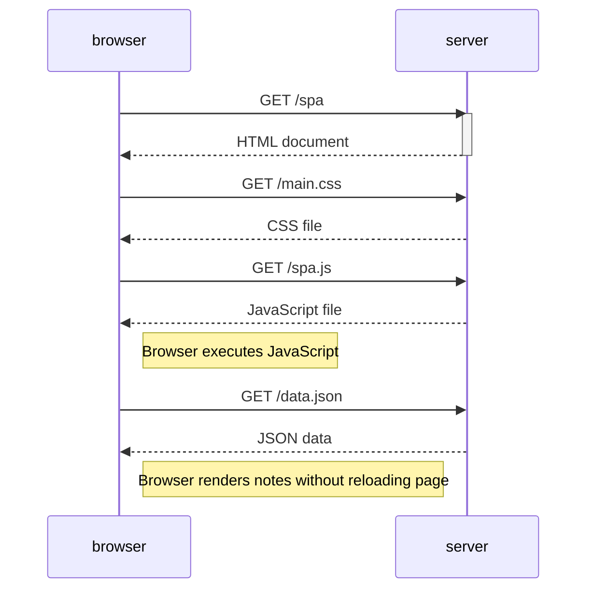

```mermaid
sequenceDiagram
    participant browser
    participant server

    browser->>server: GET /spa
    activate server
    server-->>browser: HTML document
    deactivate server

    browser->>server: GET /main.css
    server-->>browser: CSS file

    browser->>server: GET /spa.js
    server-->>browser: JavaScript file

    Note right of browser: Browser executes JavaScript

    browser->>server: GET /data.json
    server-->>browser: JSON data

    Note right of browser: Browser renders notes without reloading page
```